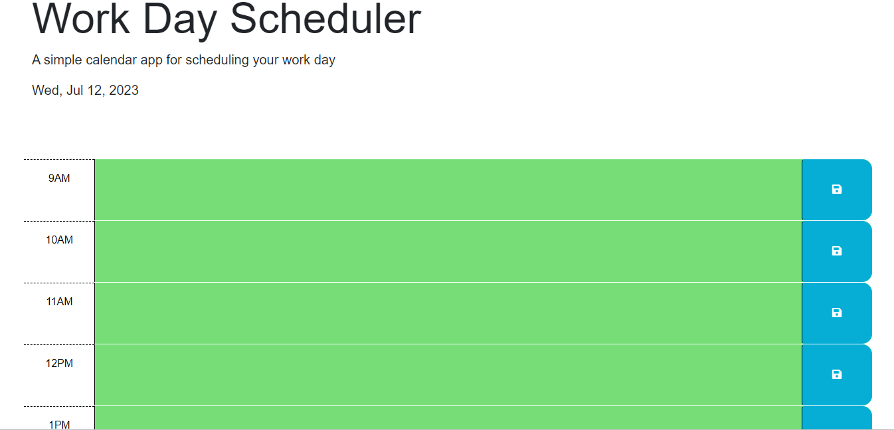

# Daily Planner
## Technology Used 

| Technology Used         | Resource URL           | 
| ------------- |:-------------:| 
| HTML    | [https://developer.mozilla.org/en-US/docs/Web/HTML](https://developer.mozilla.org/en-US/docs/Web/HTML) | 
| CSS     | [https://developer.mozilla.org/en-US/docs/Web/CSS](https://developer.mozilla.org/en-US/docs/Web/CSS)      |   
| Git | [https://git-scm.com/](https://git-scm.com/) 
| JQUERY | [https://learn.jquery.com/about-jquery/]    
| DAY.JS | [https://day.js.org/docs/en/display/format]

## Description 

[Visit the Deployed Site](https://theouo.github.io/Daily-Planner/)

For this project, I create a daily planner where users can input their tasks for the day.





## Usage 

This site is quite easy to navigate through. Once you load it, you are presented with a daily planner where you can input your tasks for the day as you see fit. You can plan your day from 9AM to 5PM and whatever you input will be saved on the page whenever you return to it.


## Learning Points 
I got  to work with the Day.JS and JQUERY APIs where I learnt more on the techniques needed to properly build this project.


## Author Info
Theodore Okeke

```md


## License

MIT License

Copyright (c) [2023] [Theodore Okeke]

Permission is hereby granted, free of charge, to any person obtaining a copy
of this software and associated documentation files (the "Software"), to deal
in the Software without restriction, including without limitation the rights
to use, copy, modify, merge, publish, distribute, sublicense, and/or sell
copies of the Software, and to permit persons to whom the Software is
furnished to do so, subject to the following conditions:

The above copyright notice and this permission notice shall be included in all
copies or substantial portions of the Software.

THE SOFTWARE IS PROVIDED "AS IS", WITHOUT WARRANTY OF ANY KIND, EXPRESS OR
IMPLIED, INCLUDING BUT NOT LIMITED TO THE WARRANTIES OF MERCHANTABILITY,
FITNESS FOR A PARTICULAR PURPOSE AND NONINFRINGEMENT. IN NO EVENT SHALL THE
AUTHORS OR COPYRIGHT HOLDERS BE LIABLE FOR ANY CLAIM, DAMAGES OR OTHER
LIABILITY, WHETHER IN AN ACTION OF CONTRACT, TORT OR OTHERWISE, ARISING FROM,
OUT OF OR IN CONNECTION WITH THE SOFTWARE OR THE USE OR OTHER DEALINGS IN THE
SOFTWARE.
